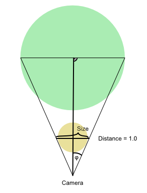

+++
title = "Conversions"
+++

## Spherical to cartesian coordinates

The formula that you want to use depends on the target coordinate system
and the orientation you choose for the sphere. To get an earth-like
orientation with poles along the Y-axis in Houdini's right-handed coordinate
system:

```c
vector sphericalToCartesian(float lon, lat, rad) {
  return rad * set(
    -cos(lat) * cos(lon),
    sin(lat),
    cos(lat) * sin(lon)
  );
}
```


*Airport locations loaded from https://openflights.org/data.html*

## Distance independent particle size

Calculate the size of a particle independent from its distance so that it
always appears in the size of a particle at distance = 1.


```c
// Calculates the angle of the camera given its focal length and diameter
// of the apperture.
float cam_angle(float f, D) {
    return 2 * atan(D / (f * 2));
}

// Calculates the logarithm of any base using the Change-of-base formula.
float log(float base, val) {
    return log(val) / log(base);
}

// Input parameters, replace per your needs.
float focal_length = 50;
float apperture = 41.04;
vector camera_pos = {0, 0, 0};
float size = 0.005;  // Particle size at distance 1

float phi = cam_angle(focal_length, apperture);
float distance = length(@P - camera_pos);
@pscale = sin(phi/2) * distance * size;
```

<p align="center"></p>
